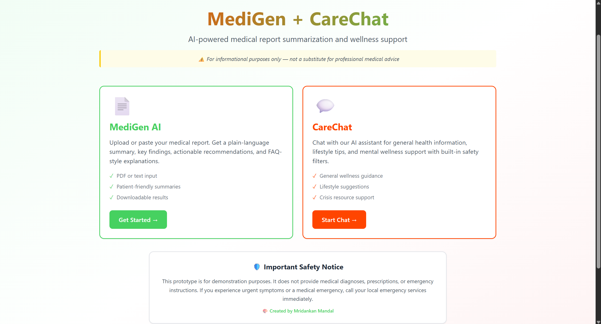
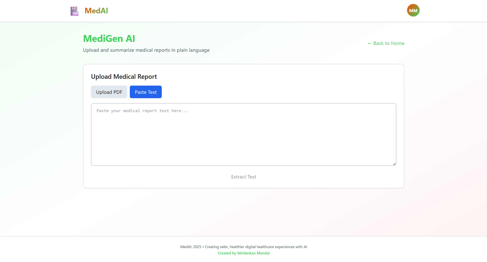
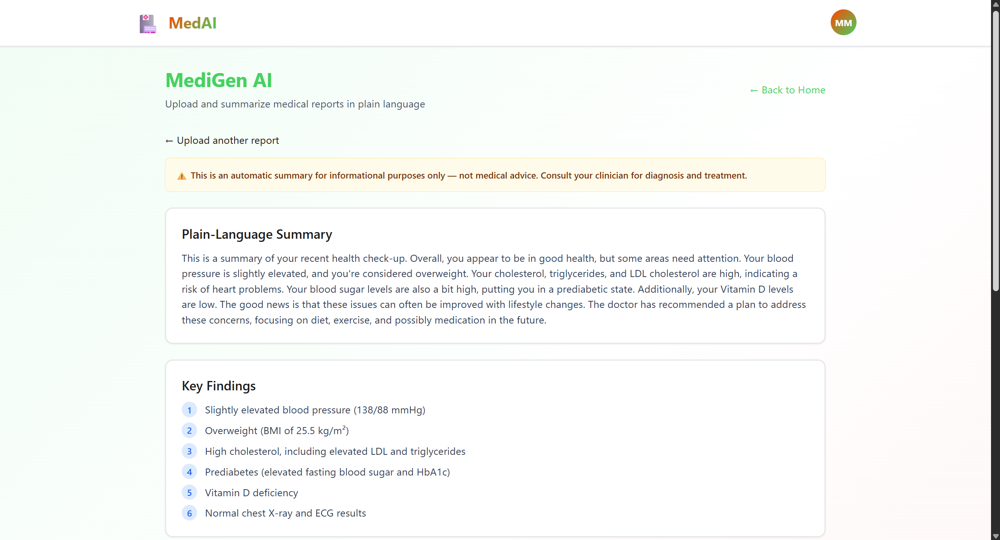
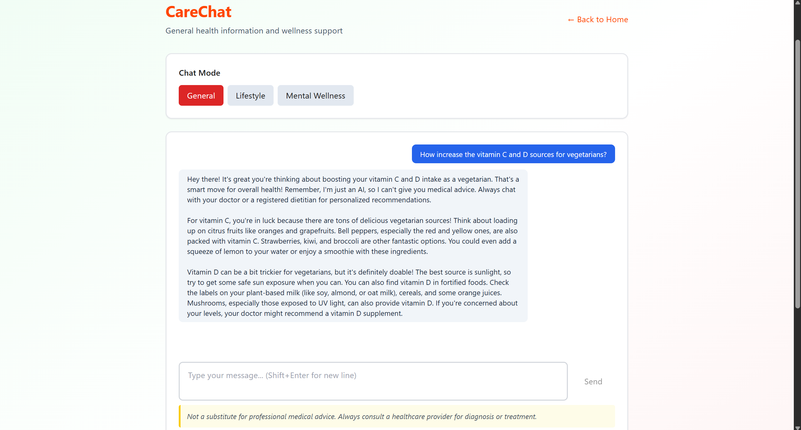
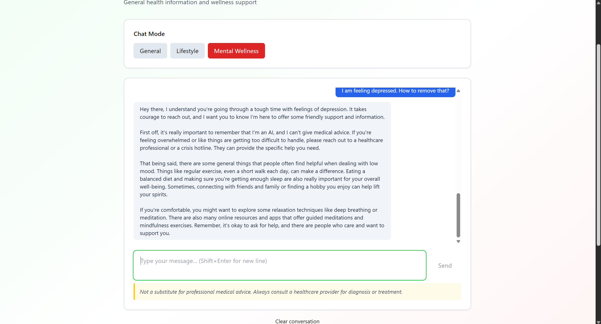

# Codebase Index:

## Introduction:

This document provides an index of the MedAI project's codebase, outlining the structure of the directories and the purpose of key files.

## Root Directory:

The root directory contains the client and server applications, as well as project-wide configuration files.

*   `client/`: Contains the React front-end application.
*   `server/`: Contains the Node.js back-end application.
*   `package.json`: Defines the project's scripts and dependencies.
*   `README.md`: This file, providing a general overview of the project.

## Client Directory (`client/`):

The client is a React application built with Vite.

*   `public/`: Contains static assets that are publicly accessible.
*   `src/`: Contains the main source code for the React application.
    *   `api/`: Contains the API client for communicating with the server.
        *   `apiClient.js`: An Axios instance configured for the back-end URL.
    *   `components/`: Contains reusable React components.
        *   `ChatWindow.jsx`: The main chat interface component.
        *   `CrisisBanner.jsx`: A banner for displaying crisis resources.
        *   `ReportUploader.jsx`: The component for uploading or pasting medical reports.
        *   `SummaryView.jsx`: The component for displaying the summarized report.
    *   `pages/`: Contains the main pages of the application.
        *   `CareChat.jsx`: The page for the CareChat feature.
        *   `Home.jsx`: The landing page of the application.
        *   `MediGen.jsx`: The page for the MediGen AI feature.
    *   `styles/`: Contains the global CSS styles.
    *   `App.jsx`: The root component that sets up the application's routing.
    *   `main.jsx`: The entry point of the React application.
*   `vite.config.js`: The configuration file for the Vite build tool.
*   `tailwind.config.js`: The configuration file for Tailwind CSS.

## Server Directory (`server/`):

The server is a Node.js application built with Express.js.

*   `lib/`: Contains the core logic of the application.
    *   `extractor.js`: Functions for extracting text from PDFs and plain text.
    *   `geminiClient.js`: A client for interacting with the Gemini AI model.
    *   `moderation.js`: Functions for content moderation and safety checks.
    *   `summarizers.js`: Functions for generating AI responses and summaries.
*   `middleware/`: Contains custom middleware for the Express application.
    *   `errorHandler.js`: A middleware for handling errors.
    *   `rateLimiter.js`: A middleware for rate-limiting API requests.
    *   `uploadMiddleware.js`: A Multer middleware for handling file uploads.
*   `models/`: Contains the Mongoose schemas for the database.
    *   `AuditLog.js`: A schema for logging audit trails.
    *   `Conversation.js`: A schema for storing chat conversations.
    *   `MedicalReport.js`: A schema for storing medical reports and their summaries.
*   `routes/`: Contains the API route definitions.
    *   `chat.js`: Defines the routes for the CareChat feature.
    *   `healthcheck.js`: Defines the route for the health check endpoint.
    *   `report.js`: Defines the routes for the MediGen AI feature.
*   `tmp/`: A temporary directory for storing uploaded files before processing.
*   `uploads/`: A directory for storing uploaded files.
*   `index.js`: The main entry point of the server application.
*   `package.json`: Defines the server's dependencies and scripts.

## Visual Demonstrations:

The home page shows the MediGen and CareChat entry cards and a visible safety notice.

The MediGen upload screen shows options to upload a PDF or paste report text for extraction.

The summary view displays a plain-language summary, key findings, and recommendations.

CareChat in general mode provides friendly lifestyle and wellness guidance.

CareChat in mental wellness mode offers supportive messages and crisis resources when needed.
